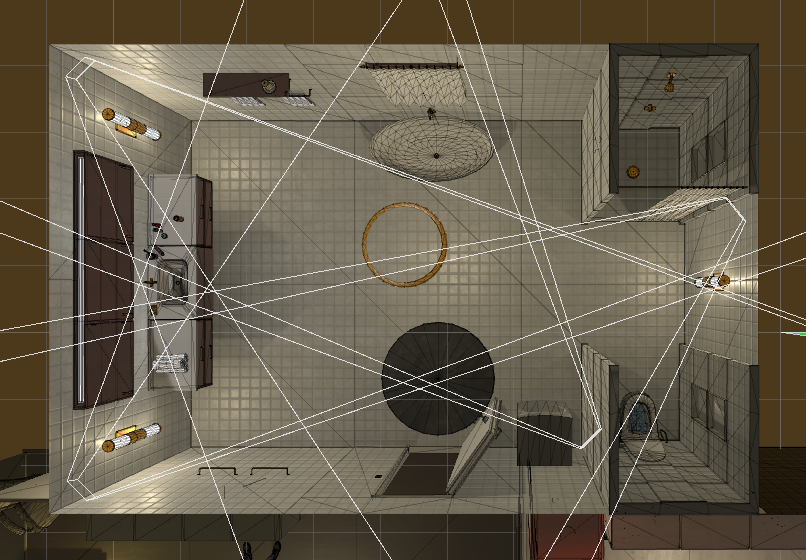
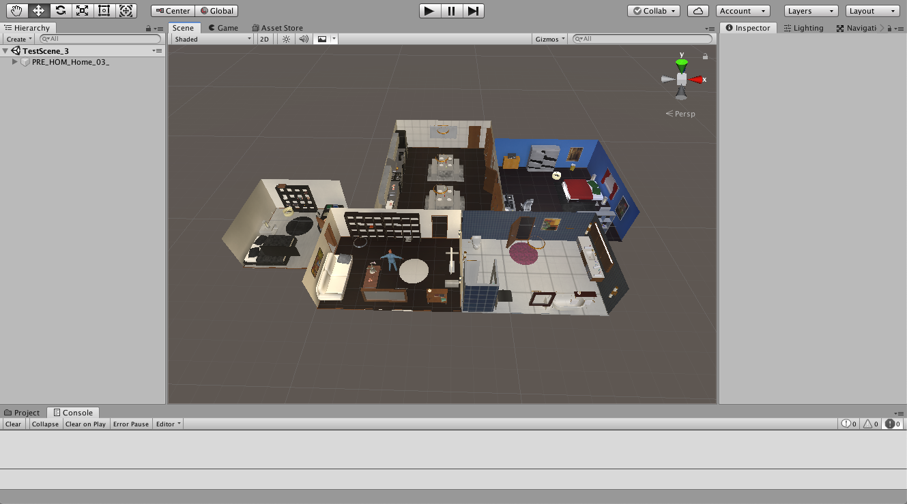

# VirtualHome-AIST Unity Source Code

This repository is an extended version from [VirtualHome Unity Source Code](https://github.com/xavierpuigf/virtualhome_unity).

This repository contains the source code of the VirtualHome-AIST environment, an extended platform to simulate complex household activities via programs. If you just want to run the simulator you can go to the main [VirtualHome-AIST repository](https://github.com/aistairc/virtualhome_aist), containing the VirtualHome-AIST API and executables of the simulator for multiple platforms. You can check more information about the original project in [virtual-home.org](https://www.virtual-home.org)

<p align="center">
  
</p>


## Table of Contents
1. Overview
2. Modification by AIST
3. Set Up
4. Testing VirtualHome
5. Documentation

## Overview
VirtualHome is a platform to simulate human activities in household environments. Activities are represented as **activity programs** - lists of actions representing all the steps required to perform a given task. VirtualHome allows executing such programs to generate videos of the given activity. It also allows actions at every single step, and obtaining observations of the environment, making it a suitable platform for RL research.

This repository contains the script files only.  A completed VirtualHome project will build the household environments, and translate the activity programs into low level actions that agents can execute. You can use it to modify VirtualHome to fit your research. If you want the complete project file, you have to contact the project supervisors. If you want to use the simulator as it is, you can ignore this repository, and download simulator from the [releases](https://github.com/aistairc/virtualhome_unity_aist/releases).

## Modification by AIST
### Addition and modification of objects
AIST divided the dataset scenarios into two parts : the one which doesn't have any room transition and the other one with room transition. For the requirement of non-transition scenarios, we had to add some objects, which can't be added by [VirtualHome API](https://github.com/aistairc/virtualhome_aist), into each scene of the original VirtualHome household environments. We added them manually by dragging and dropping the prefabs into the scenes, and adjusted the position, rotation, etc.

Since some of the objects had bugs and error, we had to restructure the hierarchy of the object or we had to adjust the transform of object's postion or rotation. In some case, we had to modify the Occlusion values especially when an object couldn't appear in different camera views. And we had to add Unity components to some of the objects. For example, we had to add NavMeshObstacle component to Door objects and Box Collider component to Clothes Shirt, Clothes Pant and Clothes Pile. Sometimes we had to change the rotation of the door. For some scenes, we had to replace the existing objects with new ones like Garbage Can and Toilet.

### Addition of new four cameras
From a suggestion describing the default camera views are not sufficient for current research, we had to add four new cameras in each room and in each scene. We placed each of the cameras at four of the upper corners of room ceiling with a proper transform value. For example,

<p align="center">
  
</p>

### Creation of new camera modes
As we started generating data for the room transition scenarios, we requrired more specific camera views which can capture every agent movements. The VirtualHome default camera modes can solve this problem but we also wanted the same camera views as the above four diagonal cameras. We needed to consider many different ways to get the solution. Finally, we concluded the issue by adding new camera modes : SPECIFIED and DIAGONAL. These new camera modes served the same functionalities as VirtualHome 'AUTO' default camera mode. The difference is we can set the desired camera indexes in these new modes. It made the camera view more specific and more stable than default one. If you want to know more detail about this, you can check it [here](https://github.com/aistairc/virtualhome_aist/tree/main/simulation/unity_simulator#modification-of-render_script-recorded-on-20230421).

## Setup
### Install Unity
We have been using **Unity 2020.3.** for development. We recommend to install it through [Unity Hub](https://store.unity.com/download). 

### Clone the repository
Clone the repository with the Unity Source Code.

```bash
git clone https://github.com/aistairc/virtualhome_unity_aist.git
```

And put this repository into the complete project set under ```Assets/Story Generator/Scripts/```.

To test the simulator, we also recommend cloning the Unity API.
```bash
git clone https://github.com/aistairc/virtualhome_aist.git
```

### Including third party assets
VirtualHome uses a set of third party assets to include more 3D objects in the environment, and provide realistic motions for the agents. If you want to develop on the simulator, you will need to purchase these assets separately and include them in the source code. Find [here](doc/third_party.md) the documentation for how to install the assets.

**Note:** Purchasing these assets is only necessary if you want to work with the Unity Source Code. You can use the Unity Executables to generate videos or do RL research without purchasing any asset. The executables are found in the [VirtualHome simulators](https://github.com/aistairc/virtualhome_unity_aist/releases).

### Test the simulator
After the previous steps you should be able to test the simulator. Open a scene in VirtualHome using

```File > Open Scene > Assets/Story Generator/TestScene/TestScene_*.unity. ```

Once you do that, you shold see in the Scene window an apartment. The following image corresponds to opening *TestScene_3.unity*.

<p align="center">
  
</p>


Then, press the play button  in Unity and make sure there are no error messages. If you see that the play button stays toggled, you are ready to interact with the simulator.


## Interacting with the simulator
If you went through the previous steps and managed to press play without issues, you can start interacting with the simulator. For that, you need to use the [VirtualHome API](https://github.com/aistairc/virtualhome_aist). You will find all the details in that repository.

If you have cloned the repository, you can test it by entering in the repository and starting python

```bash
cd virtualhome
python
```

And create a communication object **while Unity is in play mode**. 

```python
from simulation.unity_simulator.comm_unity import UnityCommunication
comm = UnityCommunication()
```

This object will communicate with Unity using port 8080. You can change that in the source code or using the Unity Executable.

To make sure that the tool works, try resetting the scene, adding a character, and walking to the fridge. Still in python, run:

```python
comm.reset(0)
comm.add_character()
comm.render_script(['<char0> [walk] <fridge> (1)'], find_solution=True)
```

You should see in Unity an agent walking towards the fridge. You can find more examples in [VirtualHome API](https://github.com/aistairc/virtualhome_aist).

### Generating an executable
You may want to interact with the simulator without using Unity. You can generate an executable so that VirtualHome runs without opening or installing Unity. You will then be able to run the tool both  on your desktop or in headless servers.

Check out the [docs](doc/build_exec.md) to learn how to generate the executable.

Note that we provide the current executables in [here](https://github.com/aistairc/virtualhome_unity_aist/releases). 

## Documentation
You can find more documentation of the VirtualHome executable in the [docs](doc).
